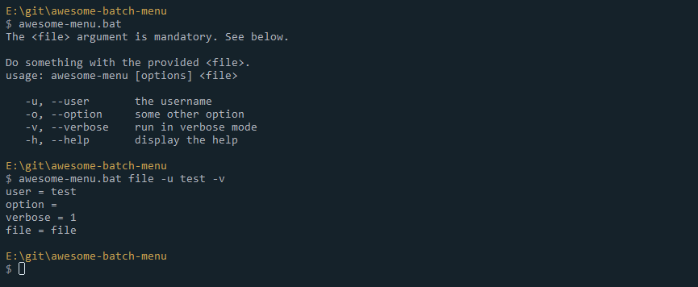

# awesome-batch-menu
This is a simple template for batch programs. It contains logic for arguments parsing and a nice default menu command.

For more advance `opts` parsing: http://stackoverflow.com/a/8162578
